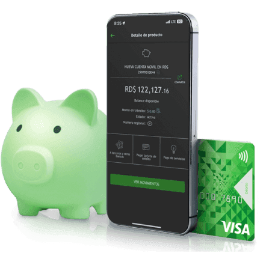

# Banco BHD - Análisis y Modelo de Negocio

**2025 // REPUBLICA DOMINICANA**

---

## Introducción y Presentación del Equipo

**Banco BHD**

ANÁLISIS Y DISEÑO DE SISTEMAS

# SITIO WEB BHD

Estructura Funcional y Modelo de Negocio (Canvas)

**Equipo:**

- Elvis Paez — A00082603
- Andy Peña — A00113929
- Robert Batista — A00111345
- Pedro Garcia — A00121080
- Jesus Garcia — A00118637

---

## Agenda Estructural

CONTENIDO DE LA PRESENTACIÓN

- 01 Objetivo General
- 02 Objetivos Específicos
- 03 Estructura Funcional
- 04 Secciones del Sitio
- 05 Sitio & Propuesta
- 06 Clientes & Canales
- 07 Recursos & Socios
- 08 Costes & Ingresos

---

## Fundamentos: Objetivo General

**Visión Estratégica de la Plataforma Digital**

Ofrecer una plataforma digital integral que permita a clientes y usuarios acceder a productos y servicios financieros, realizar operaciones en línea y obtener información institucional, de manera segura, ágil y centrada en el cliente.

**Valores clave:** SEGURIDAD, AGILIDAD

Imagen: 

---

## Objetivos Específicos (I)

- **Servicios Digitales:** Facilitar el acceso al Internet Banking para realizar operaciones financieras desde cualquier lugar con total seguridad.
- **Promoción Comercial:** Promover y comercializar cuentas, préstamos, tarjetas e inversiones a través del portal web, ampliando el alcance del banco.
- **Transparencia:** Brindar información corporativa clara: historia, misión, visión y estados financieros, fortaleciendo la confianza.

---

## Objetivos Específicos (II)

- **Atención y Soporte:** Ofrecer canales de contacto, localizador de sucursales y cajeros, FAQs y sistema de quejas para garantizar una experiencia completa y resolutiva.
- **Transformación Digital:** Impulsar la innovación y la experiencia del usuario a través de un ecosistema digital que integra la app móvil, redes sociales y la banca en línea.

---

## Estructura Funcional General

1. HEADER
   - Logo, accesos rápidos, login a banca digital y menú principal.
2. NAVEGACIÓN
   - Inicio, Banca Digital, Productos, Corporativa, Atención, Información.
3. CONTENIDO
   - Secciones de productos, transacciones y exposición de marca.
4. INFORMACIÓN
   - Noticias, sala de prensa, promociones y ciberseguridad.
5. FOOTER
   - Políticas de privacidad, términos legales y redes sociales.

---

## Secciones del Sitio (I)

- **Página de Inicio**
  - Banner principal y ofertas
  - Accesos rápidos (Cuentas)
  - Productos destacados

- **Banca Digital**
  - Consultas de saldo
  - Transferencias

  # Banco BHD - Análisis y Modelo de Negocio

  **2025 // REPUBLICA DOMINICANA**

  ---

  ## Introducción

  El presente análisis evalúa la estructura funcional y el modelo de negocio digital del portal web del Banco BHD, identificando los componentes estratégicos y operacionales que permiten ofrecer servicios financieros digitales a clientes personales, comerciales y corporativos.

  El estudio se basa en la observación directa del portal oficial del banco y su ecosistema digital, incluyendo banca en línea, aplicaciones móviles y servicios de autoservicio.

  ---

  ## Equipo

  - Elvis Paez — A00082603
  - Andy Peña — A00113929
  - Robert Batista — A00111345
  - Pedro Garcia — A00121080
  - Jesus Garcia — A00118637

  ---

  ## Objetivo General

  Analizar la estructura funcional y el modelo de negocio digital del portal web del Banco BHD, identificando sus componentes operativos, estratégicos y tecnológicos dentro del ecosistema de banca digital.

  ---

  ## Objetivos Específicos

  - Evaluar la organización funcional del portal web.
  - Identificar los bloques del Business Model Canvas presentes en la plataforma.
  - Analizar la experiencia digital ofrecida a clientes personales y empresariales.
  - Determinar cómo el sitio web soporta las operaciones y estrategia comercial del banco.

  ---

  ## Agenda Estructural

  CONTENIDO DE LA PRESENTACIÓN

  - 01 Objetivo General
  - 02 Objetivos Específicos
  - 03 Estructura Funcional
  - 04 Secciones del Sitio
  - 05 Sitio & Propuesta
  - 06 Clientes & Canales
  - 07 Recursos & Socios
  - 08 Costes & Ingresos

  ---

  ## Estructura Funcional del Portal

  1. Módulo de Acceso y Autenticación
     - Inicio de sesión para banca personal y empresarial.
     - Validación segura de usuarios.
     - Recuperación de credenciales.
  2. Módulo Transaccional
     - Transferencias interbancarias.
     - Pago de servicios e impuestos.
     - Gestión de productos financieros.
     - Consulta de balances y movimientos.
  3. Módulo Comercial
     - Solicitud digital de productos.
     - Promoción de tarjetas, préstamos y cuentas.
     - Captación de nuevos clientes.
  4. Módulo de Atención al Cliente
     - FAQs.
     - Contact center.
     - Chat y canales de soporte.
     - Localizador de sucursales y cajeros.
  5. Módulo Informativo e Institucional
     - Noticias.
     - Responsabilidad social.
     - Información corporativa.
     - Educación financiera.
  6. Módulo Omnicanal
     - Integración con app móvil.
     - Redes sociales.
     - Internet Banking.
     - Notificaciones digitales.

  ---

  ## Secciones del Sitio (resumen y observaciones)

  Secciones principales del portal (resumen):

  - Página de Inicio: banner, productos destacados y accesos rápidos.
  - Banca Digital: consultas, transferencias, pagos y gestión de cuentas.
  - Productos: cuentas, tarjetas, préstamos e inversiones.
  - Corporativa: información institucional y estados financieros.
  - Atención: FAQs, formularios, localizador de sucursales y canales de soporte.
  - Contenido: noticias, promociones y recursos de educación financiera.
  - Canales alternos: app móvil, redes sociales y contact center.

  Observaciones reales del portal:

  - El homepage prioriza productos financieros y accesos rápidos.
  - Existe segmentación clara entre clientes personales, empresariales y PYMES.
  - El portal integra accesos directos a banca digital y aplicaciones móviles.
  - El diseño utiliza CTAs visibles orientados a conversión digital.
  - La navegación está optimizada para dispositivos móviles.

  ---

  ## Tipo de Sitio Web

  Plataforma Financiera Digital Transaccional, Informativa y Comercial.

  Funciones principales:

  - Gestión de operaciones bancarias.
  - Captación digital de clientes.
  - Comercialización de productos financieros.
  - Atención y soporte omnicanal.
  - Comunicación institucional.

  ---

  ## Propuesta de Valor

  El portal digital del Banco BHD ofrece una experiencia bancaria centralizada, segura y disponible 24/7, permitiendo a clientes personales y empresariales gestionar productos financieros sin depender exclusivamente de sucursales físicas.

  Valor ofrecido:

  - Acceso inmediato a servicios bancarios.
  - Reducción del tiempo operativo.
  - Seguridad transaccional.
  - Autoservicio digital.
  - Integración móvil y web.
  - Personalización de la experiencia digital.

  ---

  ## Segmentos de Mercado

  Segmentos de Mercado:

  - Personas físicas: usuarios individuales y familias.
  - PYMES: pequeñas y medianas empresas.
  - Clientes corporativos: empresas de gran escala.
  - Clientes digitales: usuarios que operan exclusivamente mediante canales electrónicos.

  Cartera de Clientes (productos y grupos):

  - Cuentas de ahorro y corrientes.
  - Tarjetas de crédito.
  - Clientes de préstamos.
  - Empresas afiliadas y clientes empresariales.
  - Usuarios de banca digital.
  - Clientes de inversión y tesorería.

  ---

  ## Estrategia de Relación con Clientes

  Estrategia de Relación:

  - Autoservicio digital.
  - Soporte híbrido humano + IA.
  - Atención omnicanal.
  - Personalización de servicios.
  - Fidelización mediante productos integrados.

  Canales de Comunicación:

  - Canales directos: portal web, app móvil e Internet Banking.
  - Canales físicos: sucursales, cajeros automáticos y subagentes.
  - Marketing: redes sociales, correos y notificaciones push.

  ---

  ## Actividades Clave

  - Procesamiento de transacciones y validación.
  - Ciberseguridad continua y monitoreo antifraude.
  - Gestión de onboarding digital.
  - Integración con plataformas móviles y APIs.
  - Gestión de identidad y autenticación.
  - Mantenimiento IT y planes de contingencia.
  - Analítica digital y personalización.
  - Marketing digital y captación.

  ---

  ## Recursos Clave

  - Infraestructura cloud (proveedores tecnológicos).
  - APIs bancarias y pasarelas de pago.
  - Base de datos de clientes y sistemas de persistencia.
  - Sistemas de autenticación y gestión de identidades.
  - Plataformas móviles y aplicaciones.
  - Talento humano especializado (desarrollo y seguridad).
  - Redes de aceptación para pagos.

  ---

  ## Socios Clave

  - Visa y Mastercard.
  - Redes interbancarias (ACH, LBTR).
  - Proveedores tecnológicos cloud y plataformas.
  - Pasarelas de pago y procesadores.
  - Empresas de telecomunicaciones.
  - Reguladores financieros dominicanos.
  - Proveedores de ciberseguridad.

  ---

  ## Evaluación Crítica del Portal

  Fortalezas:

  - Plataforma moderna y responsive.
  - Integración web + móvil.
  - Segmentación clara de usuarios.
  - Amplio ecosistema digital.
  - Enfoque fuerte en autoservicio.

  Debilidades:

  - Alta densidad informativa en el homepage.
  - Algunas rutas requieren múltiples clics.
  - Múltiples subportales que pueden fragmentar la experiencia.

  Oportunidades:

  - Mayor automatización mediante IA.
  - Personalización avanzada basada en comportamiento.
  - Simplificación de navegación corporativa.

  Amenazas:

  - Riesgos de ciberseguridad.
  - Competencia fintech.
  - Saturación de canales digitales.

  ---

  ## Relación entre Sitio Web y Modelo de Negocio

  El portal web funciona como:

  - Canal comercial.
  - Plataforma transaccional.
  - Centro de atención.
  - Ecosistema de adquisición digital.
  - Herramienta de fidelización.

  La plataforma reduce la dependencia operativa de sucursales físicas y permite escalabilidad digital del modelo bancario.

  ---

  ## Conclusión

  El portal digital del Banco BHD representa una plataforma financiera moderna orientada a la transformación digital, integrando funciones transaccionales, comerciales y de atención al cliente dentro de un ecosistema omnicanal.

  El análisis evidencia cómo la estructura funcional del sitio soporta directamente el modelo de negocio digital del banco mediante automatización, autoservicio y captación electrónica de clientes.

  ### Recomendación final

  Antes de presentar:

  - Agregar capturas reales del sitio.
  - Incluir un Business Model Canvas visual completo.
  - Añadir una slide de análisis crítico (SWOT).
  - Proveer evidencia del portal real (URLs y capturas).
  - Mostrar claramente la conexión portal ↔ negocio.

  Eliminar:

  - Lenguaje excesivamente corporativo o publicitario.
  - Frases tipo marketing sin evidencia.
  - Conceptos genéricos sin respaldo en el portal real.

  ---

  ## Cierre

  **GRACIAS**

  ESTRUCTURA & MODELO DE NEGOCIO BHD

  BHD.COM.DO

  ---

  ## Script (resumen)

  El sitio incluye un script de navegación que:

  - Controla la visibilidad de las slides (.slide-container).
  - Maneja botones prev/next y teclado (flechas y espacio).
  - Actualiza contador de slides y tema (texto e ícono) según slide activo.
  - Calcula escala responsiva para ajustar la presentación al tamaño de ventana.

  ---

  *Documento corregido a partir de index.html y las indicaciones proporcionadas.*
