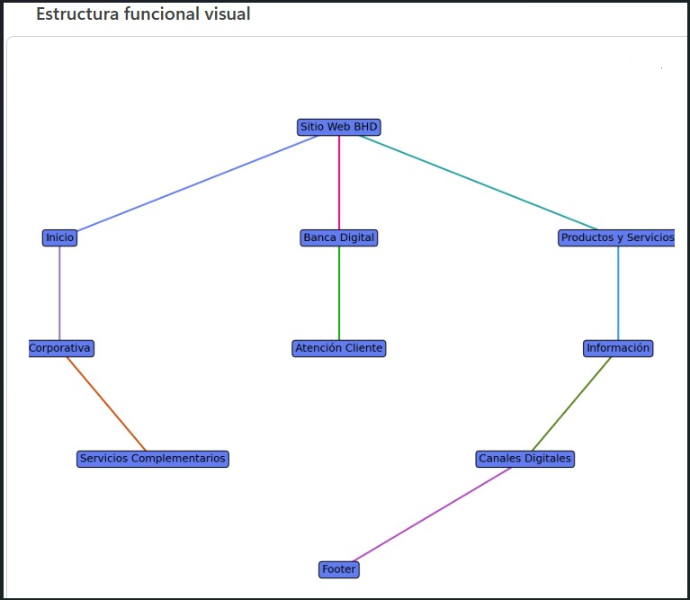

# Banco BHD — Análisis y Modelo de Negocio

**2025 // REPUBLICA DOMINICANA**

---

## Portada

SITIO WEB BHD — Estructura Funcional y Modelo de Negocio (Canvas)

**Equipo:**

- Elvis Paez — A00082603
- Andy Peña — A00113929
- Robert Batista — A00111345
- Pedro Garcia — A00121080
- Jesus Garcia — A00118637

---

## Agenda

1. Introducción y Objetivos
2. Estructura Funcional del Portal
3. Observaciones del Portal
4. Estructura Visual / Diagrama
5. Análisis del Modelo (BMC)
6. Evaluación Crítica (FODA)
7. Estructura de Costes y Flujo de Ingresos
8. Relación Sitio ↔ Negocio
9. Conclusiones y Recomendaciones

---

## Introducción

El presente análisis evalúa la estructura funcional y el modelo de negocio digital del portal web del Banco BHD, identificando los componentes estratégicos y operacionales que permiten ofrecer servicios financieros digitales a clientes personales, comerciales y corporativos. El estudio se basa en la observación del portal oficial, su app móvil y el ecosistema digital asociado.

---

## Objetivo General

Analizar la estructura funcional y el modelo de negocio digital del portal web del Banco BHD, identificando sus componentes operativos, estratégicos y tecnológicos dentro del ecosistema de banca digital.

---

## Objetivos Específicos

- Evaluar la organización funcional del portal y sus módulos principales.
- Identificar los bloques del Business Model Canvas aplicables.
- Analizar la experiencia digital para clientes personales y empresariales.
- Determinar cómo el sitio soporta las operaciones y la estrategia comercial.

---

## Estructura Funcional del Portal

1. Acceso y Autenticación
   - Inicio de sesión personal/empresarial.
   - Validación segura y recuperación de credenciales.
2. Módulo Transaccional
   - Transferencias, pagos y consulta de movimientos.
3. Módulo Comercial
   - Solicitud digital de productos; promoción de tarjetas y préstamos.
4. Atención al Cliente
   - FAQs, chat, contact center y localizador de sucursales.
5. Informativo Institucional
   - Noticias, RSE e información corporativa.
6. Omnicanal
   - Integración con app móvil, redes sociales y notificaciones.

---

## Observaciones Reales del Portal

- El homepage prioriza productos financieros y accesos rápidos.
- Segmentación clara entre personas, PYMES y clientes corporativos.
- Integración entre portal web y accesos a banca digital móvil.
- Uso intensivo de CTAs orientados a conversión digital.
- Navegación optimizada para dispositivos móviles.

---

## Estructura Visual / Diagrama

Se incluye una representación jerárquica de la arquitectura del sitio (sitemap/diagrama). Imagen de referencia en `./images/diagram.jpg`.

---

## Tipo de Sitio Web

Plataforma financiera digital: transaccional, informativa y comercial — núcleo operativo del banco en Internet.

Funcionalidades clave:
- Gestión de operaciones bancarias.
- Captación digital de clientes.
- Comercialización de productos financieros.
- Atención y soporte omnicanal.

---

## Segmentos de Mercado

- Personas físicas
- PYMES
- Clientes corporativos
- Clientes digitales (nativos digitales)

---

## Propuesta de Valor

Experiencia bancaria centralizada, segura y disponible 24/7 que permite a clientes personales y empresariales gestionar productos financieros sin depender de sucursales.

Valor diferencial:
- Inmediatez operativa
- Seguridad y cumplimiento
- Autoservicio y personalización
- Integración web + móvil

---

## Cartera de Clientes (Productos)

- Cuentas de ahorro y corrientes
- Tarjetas de crédito
- Préstamos y financiamiento
- Servicios de inversión y tesorería

---

## Relaciones y Canales

Relaciones:
- Autoservicio digital y soporte híbrido (humano + IA)
- Personalización y fidelización mediante productos integrados

Canales:
- Portal Web, Internet Banking y App Móvil
- Sucursales y cajeros automáticos
- Contact center, chat y redes sociales

---

## Actividades y Recursos Clave

Actividades:
- Gestión de onboarding digital y procesos transaccionales
- Monitoreo antifraude y ciberseguridad
- Analítica y personalización
- Mantenimiento IT y marketing digital

Recursos:
- Infraestructura cloud y servidores
- APIs bancarias y Core transaccional
- Base de datos centralizada y sistemas de identidad
- Talento especializado en desarrollo y seguridad

---

## Socios Clave

- Redes de procesamiento (Visa, Mastercard)
- Proveedores cloud y tecnológicos
- Proveedores de ciberseguridad
- Telecomunicaciones y reguladores

---

## Estructura de Costes y Flujo de Ingresos

Costes principales:
- Infraestructura y licencias
- Nómina especializada y soporte operativo
- Marketing digital y escalamiento de recursos

Fuentes de ingresos:
- Comisiones transaccionales
- Intereses por productos (créditos)
- Suscripciones empresariales y servicios asociados

---

## Evaluación Crítica (FODA)

Fortalezas:
- Plataforma moderna y responsive
- Integración web + móvil
- Enfoque en autoservicio

Debilidades:
- Alta densidad de información en la homepage
- Posible fragmentación por subportales

Oportunidades:
- Automatización mediante IA
- Personalización avanzada por comportamiento

Amenazas:
- Riesgos de ciberseguridad
- Competencia fintech

---

## Business Model Canvas (Resumen)

- Socios Clave: Visa, Mastercard, proveedores cloud, reguladores
- Actividades Clave: Procesamiento seguro, mantenimiento IT, marketing
- Recursos Clave: Core bancario, infraestructura cloud, personal
- Propuesta de Valor: Experiencia segura, 24/7, autoservicio
- Relaciones: Autoservicio + soporte híbrido (IA)
- Canales: Portal web, app móvil, contact center
- Segmentos: Personas, PYMES, Corporativos, Nativos digitales
- Estructura de Costes: Servidores, licencias, RRHH, marketing
- Flujo de Ingresos: Comisiones, intereses, suscripciones

---

## Relación Sitio ↔ Negocio

El portal es el engranaje central de la estrategia comercial: canal comercial, plataforma transaccional, centro de atención y herramienta de adquisición y fidelización, reduciendo la dependencia de sucursales físicas.

---

## Conclusiones

El portal digital del Banco BHD es una plataforma integral que soporta el modelo de negocio digital mediante automatización, autoservicio y captura electrónica de clientes. Ofrece competitividad frente a nuevas tecnologías si se mantiene la inversión en seguridad y experiencia de usuario.

---

## Recomendaciones

- Incluir capturas reales del portal en la presentación.
- Añadir un Business Model Canvas visual completo.
- Simplificar rutas críticas para conversión.
- Implementar mayor automatización del soporte (IA).
- Centralizar subportales para evitar fragmentación.

---

## Cierre

**GRACIAS**

ANÁLISIS DE SISTEMAS BHD — BHD.COM.DO

---

## Script (resumen)

El archivo `index.html` incluye un script que:

- Controla la visibilidad de las slides (`.slide-container`).
- Maneja navegación con botones y teclado (flechas, espacio).
- Actualiza contador y tema según slide activo.
- Calcula escala responsiva para adaptar la presentación.

---

*Documento actualizado a partir de `index.html`.*
